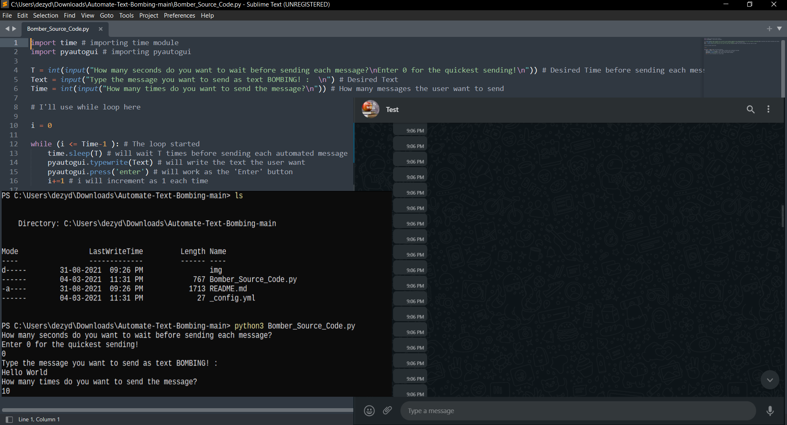
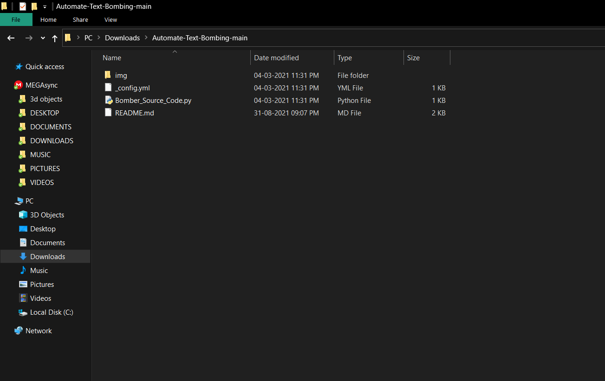
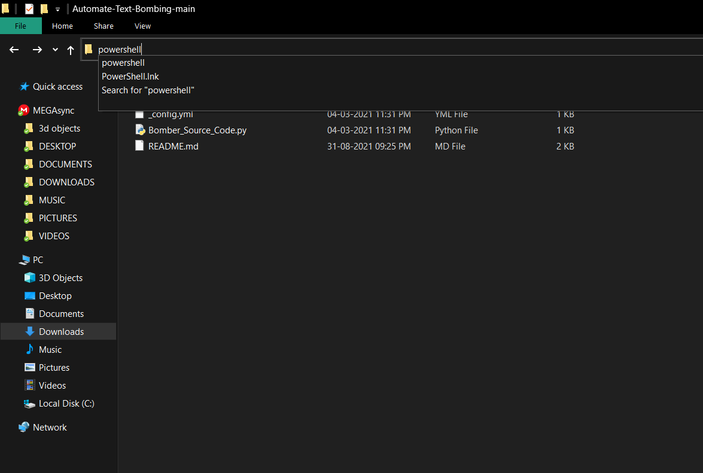
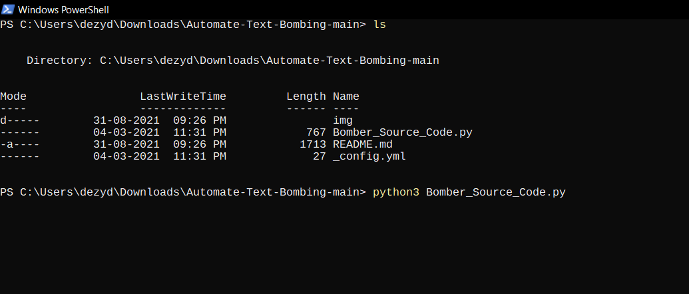
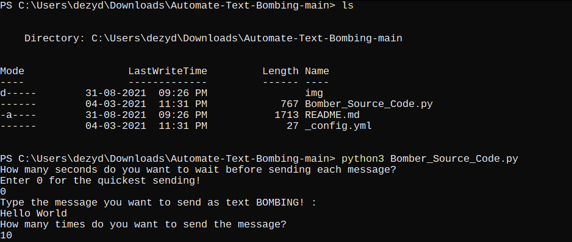

# Automate Text Bombing

### You can use this Python code in anywhere you want to, whether it can be Facebook, messenger, WhatsApp, Telegram, Signal or anywhere else!

<br>

## Follow these steps:
- Open the [Source Code](Bomber_Source_Code.py) to any IDE or Text Editor.
- Before running the code, open the text box where you want to send your automate bomb!
- If you find any error of PyAutoGui, then you may check the documentation of [PyAutoGui](https://pypi.org/project/PyAutoGUI/). If you find any other errors, then you'll find your solution in [Stack Overflow](https://stackoverflow.com/).
- For installing PyAutoGUI, run this command through your terminal:
 ```
 pip3 install pyautogui
 ```
- You're all set for running your BOMBER! 
<br>


---------------------------------------------

<br>

## Follow these steps during running your Text BOMBER!

- Provide how many seconds you want to wait before sending each automated messages. Enter 0 for the quickest sending.
- Provide the text you want to send as an automated message bomb.
- Provide the amount of how many messages you want to send. You can send any amount of messages you want.
- Run the program and quickly take your cursor to the desired text box. For using the comment section of any media, click on the text box of the comment section. If you want to use this in any chat box, take the cursor to the chatbox and click on the text box for once. 
- Voila! The Automated text bombing has been started!



## You can also use Windows powershell to run your BOMBER!

- Install Python3 from Microsoft store
- Just open the folder location



- Type Powershell in the search bar



- Type the above command pip3 install pyautgui
- When the installtion completes, Type python3 Bomber_Source_Code.py



- Then choose the desired options
- Move the mouse cursor to the desired location




